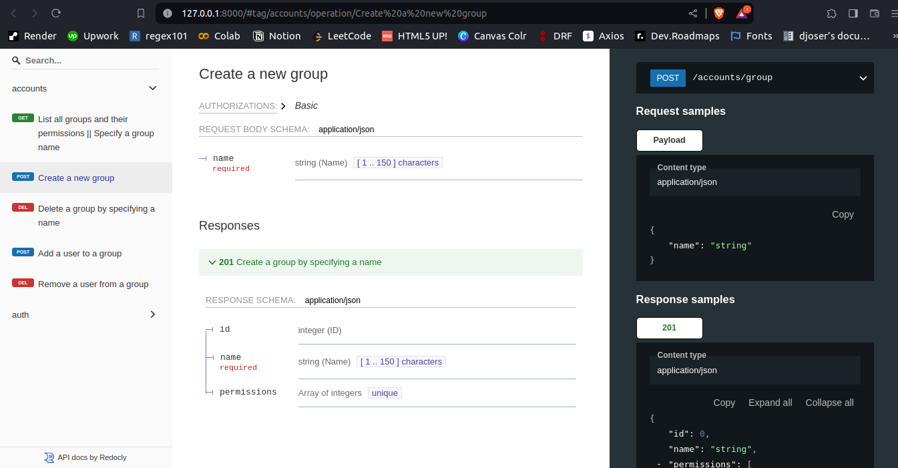

# User Authentication System

## Overview

This project implements a robust User Authentication System, designed to manage user registrations and logins efficiently and securely. It uses Django framework for backend operations, emphasizing security and ease of use.

### Screenshot of the Application
<a href='https://authentication-system-v1.vercel.app' target='_blank'>
    
</a>

## How to run application
1. Clone the repository
```
    git clone https://github.com/juliusmarkwei/auth-system
```
2. Change current directory to /auth-sustem
```
    cd /auth-system
```
3.  Configure the database to any of your choice in the `settings.py` file. I recommend <a href='https://supabase.com'>Supabase</a> database. Specify these variables as follows to connect the database to the application.\
Note: It is best practice to put the values for these variables in an `.env` file in you root directory.
```
    DB_HOST=your_db_host
    DB_USER=your_db_user
    DB_PASSWORD=your_db_password
    DB_NAME=your_db_name
    DB_PORT=your_db_port
    DB_ENGINE=your_db_engine
```
Add your secret key for the project also in the `settings.py` file. You can generate a secrete key as follow:
```
    from django.core.management.utils import get_random_secret_key
    print(get_random_secret_key())
```
Copy the secrete key and add it to your _SECRETE_KEY_ in your `.env` file.
```
    SECRET_KEY=your_secret_key_here
```

4. Migrate into your new database
```
    python3 manage.py makemigrations
    python3 manage.py migrate
```

5. Set us a superuser account by privode the neccesary credentials
```
    python3 manage.py createsuperuser
```

6. Run the server
```
    python3 manage.py runserver
```

## Reporting Issues 🚩
If you encounter any bugs or issues, please report them using the <a href='https://github.com/juliusmarkwei/auth-system/issues'>Issues</a> section of my GitHub repository. When reporting issues, please include:

* A clear and descriptive title.
* A detailed description of the problem, including steps to reproduce it.
* Any relevant logs or error messages. Your environment details (e.g., Django version, DRF version, database, etc.).

## Want to Contribute? 💁🏼
I love receiving pull requests from the community! If you have an improvement or a new feature you'd like to add, please feel free to do so.

__Happy coding!__ 👍